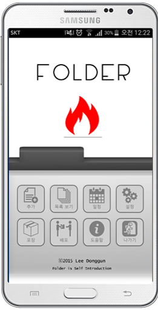
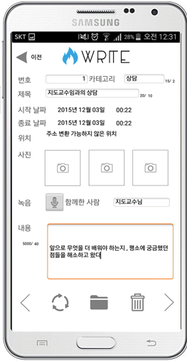
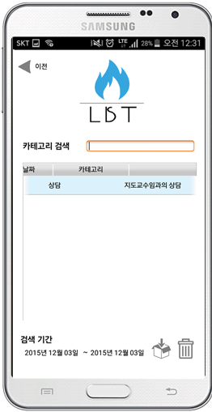
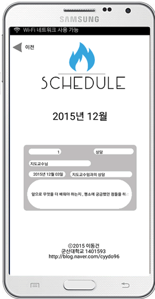
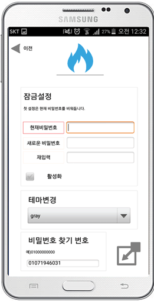
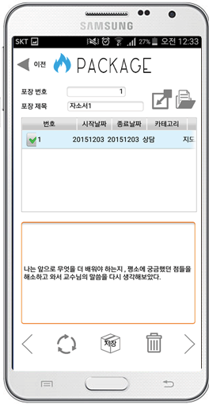
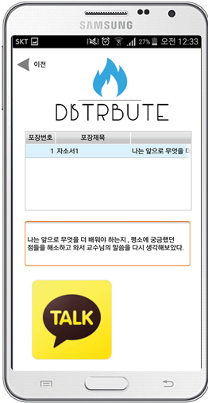
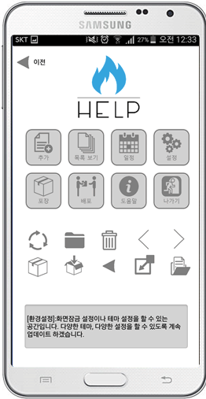
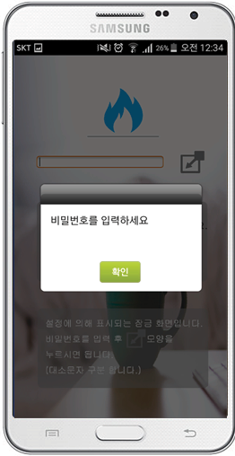
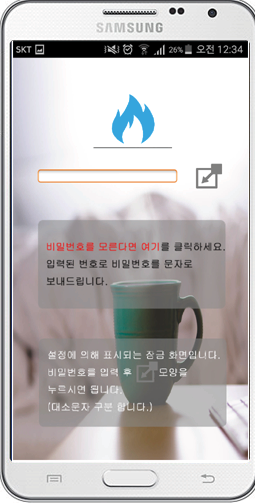

# FOLDER
FOLDER

- Tool : mbizmaker

- OS : Android

- 대학교 과제로 구현한 앱입니다.

- 자신의 인생을 폴더에 담는다는 의미로 폴더라는 이름으로 구현했습니다.

- 자신의 일정을 등록할 수도 있고 일기처럼 사용이 가능합니다.

- 자신이 작성했던 내용들을 하나로 압축시켜 자기소개서로 만들 수 있도록 하는 기능도 있습니다.

- 카카오톡으로 해당 내용을 공유할 수 있는 기능도 있습니다.

- 비밀번호도 설정할 수 있어 자신만 볼 수 있도록 할 수 있습니다.

- preview

    
    
    
    
    
    
    
    
    
    